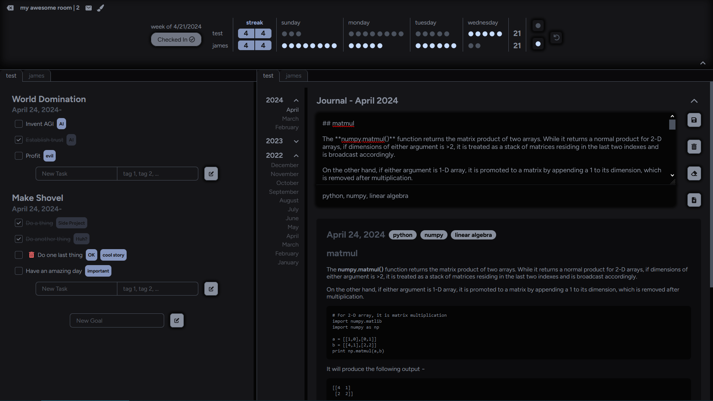
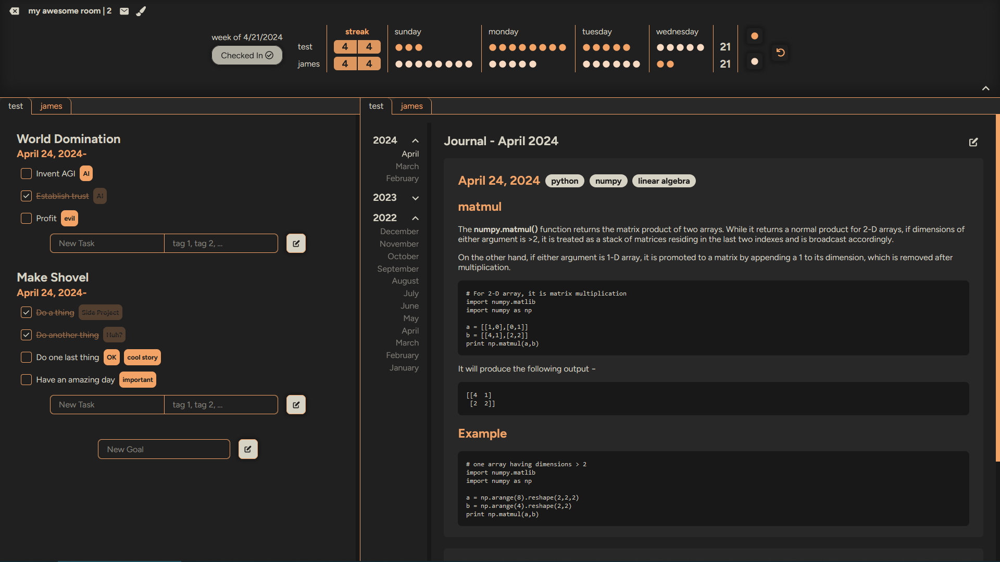
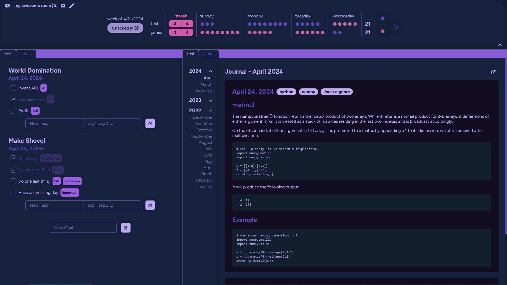
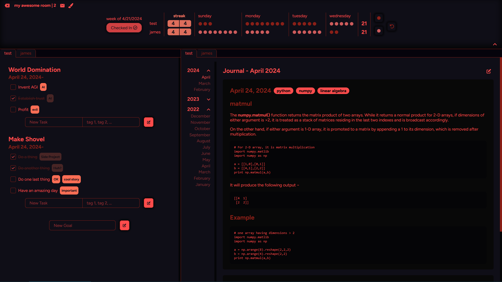
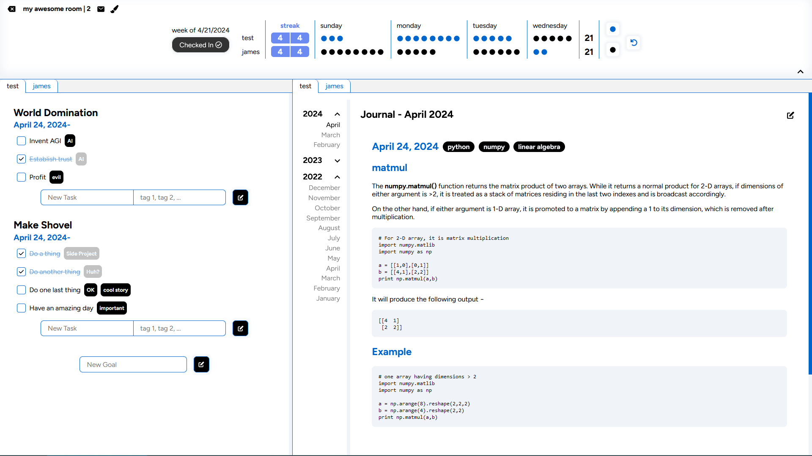
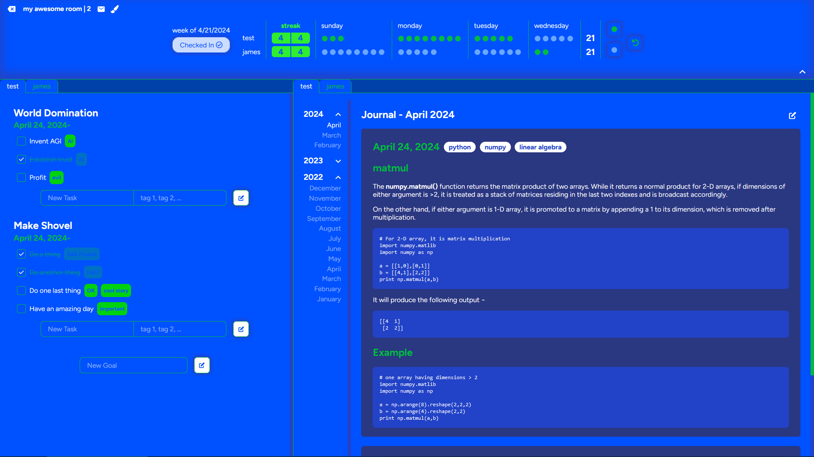
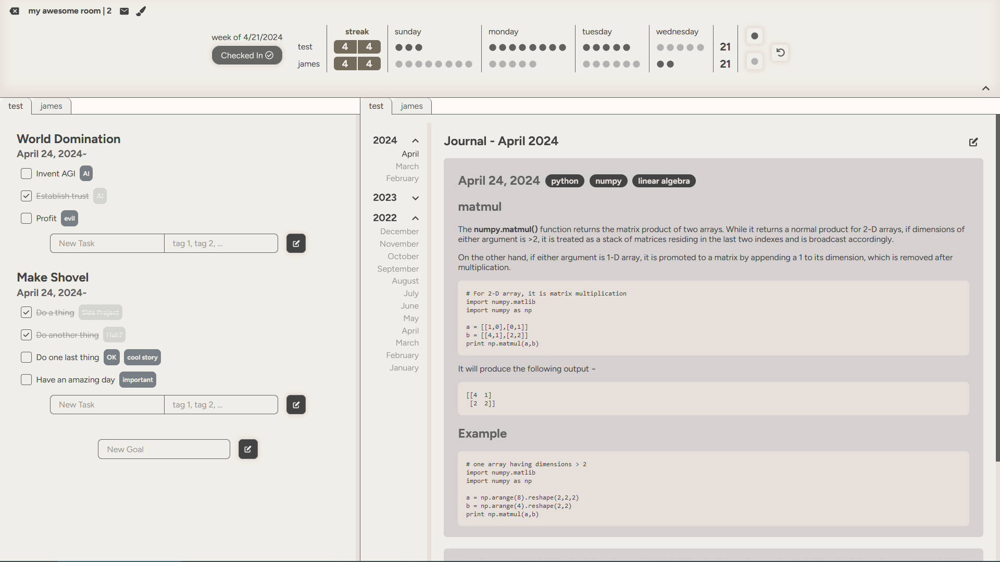
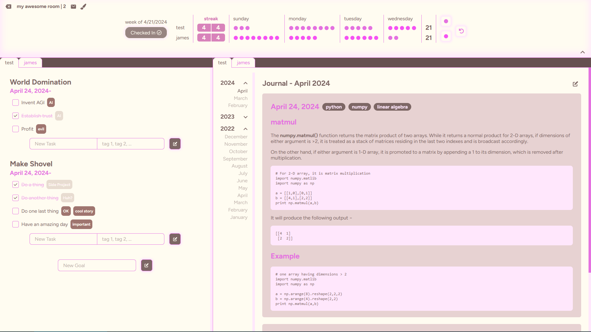

# Shovel

Shovel is a tool that helps you go deep in your work.

## Features

- Create goals and features that automatically track dates for you.
- Write up daily status updates in a journal to keep your mind clear and jog down any important info.
- Collaborate with others in a room to keep each other on track.
- Maintain a daily streak of work to feel good about being consistent.
- Keep track of how many hours of ['deep work'](https://calnewport.com/deep-work-rules-for-focused-success-in-a-distracted-world/) you achieved on each day of the week.

## Screenshots










... and 24 other themes!

Visit [Shovel](https://ovel.sh) to start tracking your work today!

## Setup Guide

To run shovel locally, follow these steps:

1. Have node.js, postgresql, and redis installed.
2. Clone the repo.
3. In the root directory, create files named `config.json`, `psql_login.json`, and `redis_login.json`.
4. In `config.json`, enter:

````
{
    "secureSession": false,
    "local": true
}
````

5. In `psql_login.json` enter:

````
{
    "username": "[your postgres user]",
    "password": "[your postgres user password]"
}
````

6. In `redis_login.json` enter:

````
{
    "password": "[redis password, if you have one set up. not necessary]"
}
````

7. Run `npm install` in the root folder.
8. Run `npm install` in the `/client` directory.
9. To run the api server, run `node index` or `nodemon index` for reloading after file changes during dev.
10. To run the next dev server, run `npm run dev` from inside the `/client` folder.
11. Sequelize should create all the tables defined in `models/models.js`, however sometimes it messes up so you may need to use the sql in `sql/create-tables.sql` file manually.
